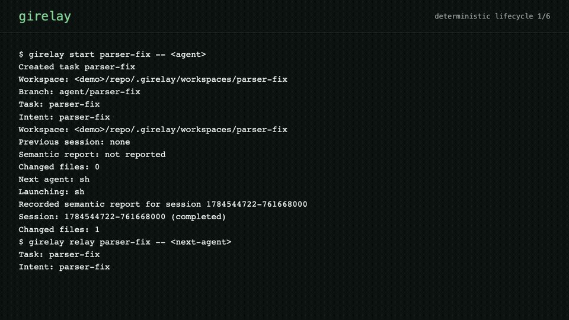
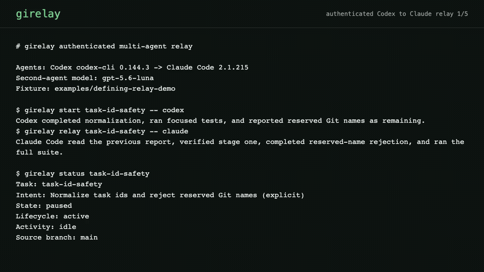

# girelay

[](https://github.com/Ddnirvana/girelay/actions/workflows/ci.yml)


**Git worktrees built for coding-agent relay.**

girelay gives every agent task an isolated native Git worktree, lets another
agent continue the same durable task, merges reviewed work back to the source
branch, and keeps recovery points before anything destructive happens.

```bash
girelay setup codex
girelay start auth-fix -- codex
girelay relay auth-fix -- claude
girelay status auth-fix
girelay merge auth-fix --dry-run
girelay merge auth-fix
girelay clean auth-fix
```

Git remains the storage and collaboration layer. girelay does not push, open
pull requests, host repositories, or pretend it can infer an agent's reasoning.



The animation is generated from a real deterministic CLI session. See the
[transcript](assets/demo/girelay-run-demo-transcript.txt) and
[MP4](assets/demo/girelay-run-demo.mp4).

The defining authenticated relay uses Codex for a partial implementation and
Claude Code to verify the handoff and finish the task, followed by preview,
merge, cleanup, and actual rollback recovery:



See its [reviewed evidence](docs/evidence/multi-agent-relay-2026-07-20.md),
[transcript](assets/demo/multi-agent-relay-transcript.txt), and
[MP4](assets/demo/multi-agent-relay.mp4).

## Why It Exists

`git worktree` solves checkout isolation. It does not define a task, prevent two
agents from entering the same workspace, preserve uncommitted state at relay
boundaries, or tell the next agent what was decided and what remains.

girelay adds those session semantics:

- one `agent/<task>` branch and native worktree per task;
- source-owned metadata excluded through `.git/info/exclude`;
- exclusive task locks while an agent, merge, or cleanup is active;
- hidden Git snapshots that preserve committed and uncommitted state without
  adding checkpoint commits to the task branch;
- optional semantic reports written by an installed agent skill;
- source-side squash or history-preserving merge with rollback refs;
- worktree cleanup that retains the task branch by default;
- verified bundle archives and guarded recovery.

## Install

```bash
cargo install girelay
girelay --version
```

Tagged releases also provide checksummed binaries for Linux, macOS, and
Windows, plus Debian packages for `amd64` and `arm64`. See
[installation](docs/installation.md) for verified download and source-build
instructions. Homebrew is advertised only after its real tap passes an install
test against published release assets.

## First Task

From a clean source checkout on `main`:

```bash
girelay setup codex
girelay start parser-fix -- codex
```

The task id is also the durable intent by default. Add `--intent "Recover
malformed bodies without changing valid parsing"` when the id is not enough
context for agents.

The worktree is `.girelay/workspaces/parser-fix`. Inspect it with normal Git:

```bash
git -C .girelay/workspaces/parser-fix status
git -C .girelay/workspaces/parser-fix diff
girelay status parser-fix
```

Continue with another agent when useful:

```bash
girelay setup claude
girelay relay parser-fix -- claude
```

Then merge from the clean source checkout:

```bash
girelay merge parser-fix --dry-run
girelay merge parser-fix --strategy squash --message "fix: recover malformed bodies"
girelay clean parser-fix
```

The preview reports changed paths, commits, overlap with other active tasks,
source divergence, deterministic warnings, configured checks, and the rollback
refs that a real merge would create. It does not run checks or change Git state.

`clean` removes only the worktree. `agent/parser-fix`, snapshots, and rollback
refs remain. Branch deletion is a separate guarded choice:

```bash
girelay clean parser-fix --delete-branch
```

## What Relay Means

girelay separates facts by trust source:

- **observed by girelay:** Git snapshots, changed paths, process exit status,
  timestamps, and lock state;
- **reported by agent:** summary, decisions, failed attempts, tests, risks,
  blockers, remaining work, and next action.

The second category is available only when the agent follows the girelay skill
protocol. Without a skill, isolation, parallel worktrees, merge, cleanup, and
recovery still work; semantic handoff is honestly shown as `not reported`.

Read [Agent Relay: From Worktrees to Durable Handoffs](docs/agent-workflow.md)
for the complete model and examples.

## Commands

| Command | Purpose |
| --- | --- |
| `setup <codex|claude|pi>` | Install the semantic relay skill at user scope. |
| `start <task> [--intent ...] -- <agent>` | Create a worktree and optionally run the first agent. |
| `relay <task> -- <agent>` | Continue the same task in another recorded session. |
| `status [task] [--json]` | Show the repository dashboard or one detailed task view. |
| `merge <task> --dry-run` | Preview integration, checks, divergence, overlap, and rollback refs. |
| `merge <task> --strategy squash|preserve` | Check and integrate work into the source branch. |
| `clean <task>` | Remove the worktree while retaining recoverable Git state. |
| `recover list|show|restore|unlock` | Inspect recovery state, restore it, or repair a stale lock. |

See [command reference](docs/commands.md) for flags and refusal behavior.
The [documentation index](docs/README.md) links the complete user, safety,
integration, and maintainer references.

## Agent Compatibility

| Agent | Current evidence |
| --- | --- |
| Codex CLI | Authenticated v2 lifecycle: isolated repair, semantic report, external test verification, squash merge, rollback refs, and cleanup. |
| Claude Code 2.1.215 | Authenticated second-agent relay: previous-report verification, focused completion, semantic report, merge, cleanup, and rollback recovery. |
| Pi 0.80.2 | Authenticated v2 lifecycle with GPT-5.6 Luna: isolated repair, semantic report, external test verification, squash merge, rollback refs, and cleanup. |
| Generic shell agents | Deterministic start, relay, merge, and clean lifecycle in every validation run. |

See the reviewed [Codex evidence](docs/evidence/codex-v2-live-2026-07-15.md),
[Pi evidence](docs/evidence/pi-v2-live-2026-07-20.md), and
[evidence-level definitions](docs/agent-compatibility.md).

## Parallel Coding

Start independent tasks from the same source checkout:

```bash
girelay start auth-fix -- codex
girelay start docs-sync -- claude
girelay status
```

The dashboard warns when active tasks touch the same path. This is coordination
evidence, not proof of a textual conflict and never an automatic merge refusal.

Each agent receives a separate files-and-index view. This is Git isolation, not
a security sandbox: processes still share the machine, network, ports, caches,
credentials, remotes, and repository refs.

## Safety Boundary

- no network fetch, push, force push, pull request, or hosted-provider mutation;
- source checkout must be clean and on the recorded target branch before merge;
- checks run before branch finalization and source integration;
- task and source rollback refs are created before history changes;
- merge conflicts restore the clean source commit;
- dirty cleanup is refused unless archived or explicitly discarded;
- branch deletion requires an unchanged merge record and matching tips;
- stale source rollback is refused;
- live parent or child processes prevent stale-lock recovery;
- `.girelay/` is excluded locally and never added to tracked project files.

The detailed contract is in [Safety Model](docs/safety.md).

## Development

```bash
cargo test
bash scripts/validate.sh
bash scripts/release-check.sh
```

## License

MIT. See [LICENSE](LICENSE).
